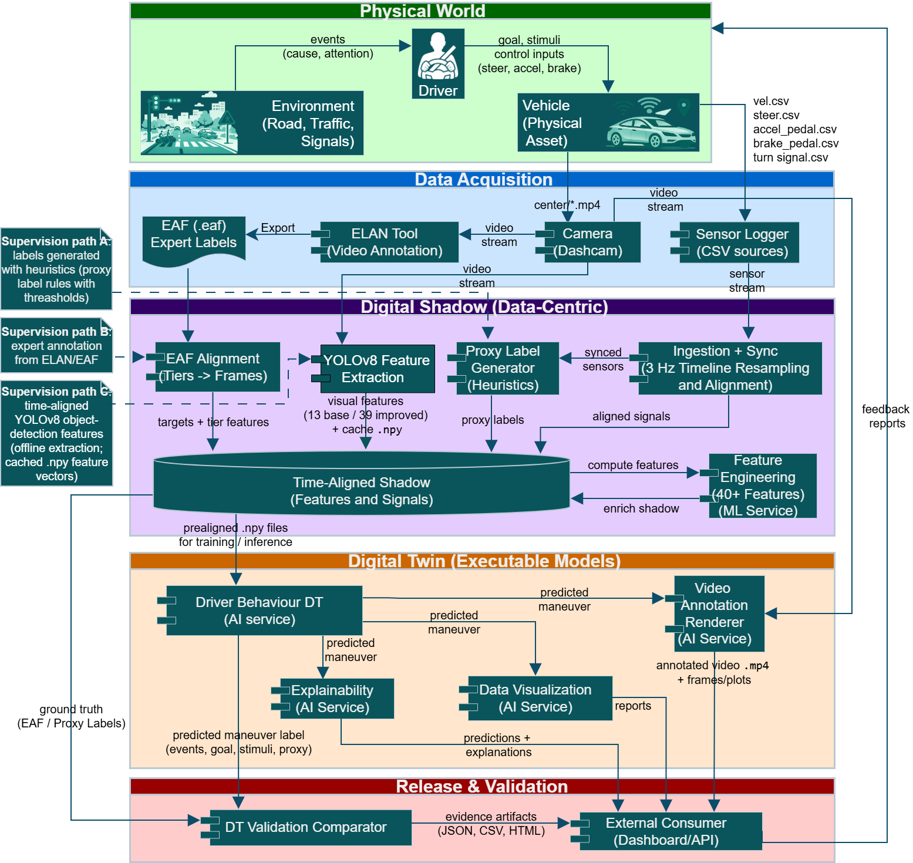

# HDD Instance

This folder contains a concrete **Intelligent Mobility application scenario** based on the Honda/HDD context.

It is the current instance-level realization of the TWIMO framework in this repository.

---

## Purpose

The purpose of this folder is to connect:

- the TWIMO Core
- the Intelligent Mobility domain metamodel
- a concrete created model
- the implementation code of the scenario

This is the most application-specific part of the repository.

---

## Scenario role

The HDD instance acts as a concrete demonstration of how the framework can be instantiated for a real Intelligent Mobility case.

In the context of the associated paper, this scenario is used to show how a model-driven engineering structure can support a Digital Twin workflow for mobility-related behavioural analysis.

---

## HDD dataset context

The application scenario is grounded on the **Honda Research Institute Driving Dataset (HDD)**, a large-scale real-world driving dataset collected in the San Francisco Bay Area for driver behaviour understanding and causal reasoning.

In the original setting, HDD combines synchronized multimodal sources, including front-facing video and vehicle-related signals. In this repository, the scenario is built around the sources that are operationally used in the TWIMO workflow:

- **sensor CSV streams**, representing vehicle dynamics and control-related measurements;
- **dashcam video**, used both for expert annotation support and optional visual feature extraction;
- **ELAN/EAF annotations**, used to encode expert semantic labels.

A key aspect of HDD is its structured behavioural annotation process. The original labels are created with **ELAN** and exported as **`.eaf` files**, following a layered annotation logic that includes goal-oriented actions, stimulus-driven actions, causes, and attention cues. This makes HDD particularly suitable for a TWIMO instantiation in which different supervision strategies can coexist on top of the same synchronized data backbone.

---

## TWIMO HDD application scenario

**Figure.** TWIMO HDD application scenario with layered workflow, supervision paths, and data-enrichment regimes.

The figure summarizes the end-to-end structure adopted in this folder and should be read as a layered pipeline.

### 1. Physical World

The top layer represents the **runtime mobility setting** composed of:

- the **Environment** (road, traffic, signals);
- the **Driver**;
- the **Vehicle**.

In the scenario, the environment generates events and stimuli that influence the driver, while the driver produces control inputs such as steering, acceleration, and braking, which affect the physical vehicle. This layer captures the real-world system that is observed and later mirrored by the data-centric and executable TWIMO layers.

### 2. Data Acquisition

The second layer collects the raw evidence used by the scenario:

- the **Camera (Dashcam)** provides the video stream;
- the **Sensor Logger** provides structured CSV signals such as velocity, steering, acceleration pedal, brake pedal, and turn-signal information;
- the **ELAN Tool** is used to annotate video and export expert labels in **EAF** format.

This layer is the bridge between the physical system and the computational pipeline. It keeps the original acquisition sources separate, so that later processing can align them in a traceable way.

### 3. Digital Shadow (data-centric backbone)

The central layer is the **Digital Shadow**, which creates a shared synchronized representation of heterogeneous data. Its role is to transform raw video, sensor streams, and labels into a common timeline that can be reused by all downstream services.

In this scenario, the Digital Shadow includes:

- **ingestion and synchronization** of heterogeneous streams on a common timeline;
- **timeline resampling** at a fixed operating point (3 Hz in the described workflow);
- **EAF alignment**, which maps expert interval annotations onto synchronized timesteps;
- **proxy label generation**, which derives dense manoeuvre labels from aligned sensor signals using heuristic rules when expert labels are not used;
- **YOLOv8 feature extraction**, which enriches the shadow with video-derived descriptors cached as reusable feature vectors;
- **feature engineering**, which computes additional machine-learning-ready variables from aligned signals.

The output of this layer is the **Time-Aligned Shadow**, namely the shared feature and signal representation used for training, inference, explainability, and validation.

### 4. Digital Twin (executable AI services)

The next layer contains the executable services that consume the Digital Shadow:

- the **Driver Behaviour DT**, which predicts behavioural or manoeuvre-related outputs;
- the **Explainability** service, which generates interpretable evidence linked to predictions;
- the **Data Visualization** service, which produces reports and summaries;
- the **Video Annotation Renderer**, which overlays predictions or semantic outputs on the video.

This is the operational AI layer of the scenario. The important point is that different behavioural models and supervision settings can be evaluated while keeping the same shared Digital Shadow structure and the same service interfaces.

### 5. Release & Validation

The final layer externalizes the results of the pipeline through:

- a **DT Validation Comparator**, which compares predictions against expert or proxy ground truth;
- an **External Consumer**, such as dashboards or APIs consuming the produced outputs.

The scenario therefore closes the loop by producing persistent evidence artifacts such as reports, plots, CSV/JSON outputs, and annotated videos.

---

## Supervision and enrichment regimes shown in the figure

A relevant aspect of the figure is that it makes explicit three orthogonal workflow variants that can be enabled without redesigning the architecture.

### Supervision Path A - Proxy heuristic labels

In this regime, supervision is generated automatically from synchronized sensor signals through conservative heuristic rules. It is useful when dense manual labels are not available and provides a scalable baseline for manoeuvre prediction.

### Supervision Path B - Expert EAF labels

In this regime, expert annotations created in ELAN and exported as **`.eaf`** are aligned to the synchronized timeline. This provides semantically richer targets, such as goal- or stimulus-related labels, directly grounded in expert annotation.

### Supervision Path C - YOLO visual enrichment

In this regime, the supervision target remains unchanged, but the input representation is enriched with video-derived features extracted from the dashcam using **YOLOv8**. These descriptors are time-aligned, cached, and concatenated to the synchronized representation.

The figure also reflects the progressive input configurations discussed in the document:

- **B0**: CSV + EAF;
- **B1**: CSV + EAF + compact YOLO-based visual features;
- **B2**: CSV + EAF + richer YOLO-based visual descriptors.

This means that the same scenario can be reused to study the effect of stronger supervision and richer multimodal input, while preserving the same overall TWIMO backbone.

---

## Mapping to the TWIMO metamodel

As described in the document, the application scenario represented in the figure is not only an implementation workflow, but also an instance-level realization of the TWIMO metamodel stack.

### TWIMO core perspective

From the **TWIMO Core** perspective, the figure instantiates the main pipeline concepts:

- **data acquisition** from heterogeneous sources;
- **Digital Shadow construction** through synchronization, alignment, and transformation;
- **AI services** for prediction, explainability, visualization, and rendering;
- **evidence traceability**, culminating in validation artifacts and external outputs.

### Intelligent Mobility domain perspective

From the **Intelligent Mobility** domain perspective, the same figure gives typed meaning to the scenario elements:

- **Environment**, **Driver**, and **Vehicle** correspond to the physical mobility system;
- behavioural and contextual concepts such as **goal**, **stimulus**, **cause**, **attention**, and **control actions** provide the semantics for labels, events, and predicted outputs;
- manoeuvre-related outputs are interpreted as domain-level driving-behaviour concepts rather than as isolated numeric predictions.

### Why this matters

This mapping is important because it shows that the HDD instance is not just a standalone implementation. Instead, it is a concrete example of how:

- the **core TWIMO execution structure** remains stable;
- the **domain metamodel** provides the behavioural and mobility semantics;
- the **same architecture** can support multiple supervision strategies, feature configurations, and AI models.

In other words, the figure captures both the **engineering pipeline** and the **model-driven traceability structure** of the scenario.

---

## Main contents

This folder currently includes:

- `model/`  
  the model instance created through the Intelligent Mobility graphical tooling

- `code/`  
  the implementation of the scenario

Together, these two subfolders connect modeling and execution.

---

## Why this folder matters

This folder demonstrates the transition from:

- abstract framework concepts
- to domain concepts
- to a concrete application scenario

It therefore provides an example of TWIMO in practice.

---

## Typical usage

A typical usage flow is:

1. inspect the model in `model/`
2. inspect the implementation in `code/`
3. use the figure above to understand how acquisition, Digital Shadow construction, AI services, and validation are connected
4. understand which supervision path or enrichment regime is active in the considered experiment
5. use the structure as a basis for replication, extension, or alternative scenarios

---

## Notes

This folder should remain aligned with:
- the Intelligent Mobility metamodel
- the created model instance
- the assumptions encoded in the application code
- the synchronization, supervision, and enrichment logic represented in the scenario figure

If the scenario evolves, changes in models and code should remain traceable.